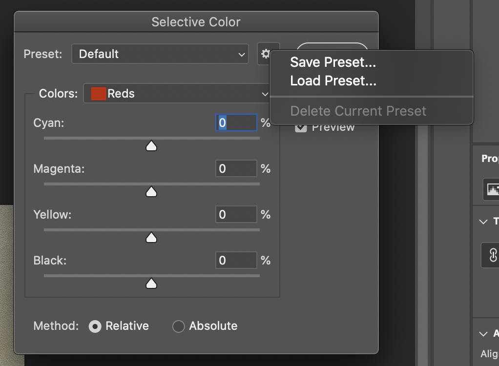

{
  "date" : "2022-02-12",
  "keywords" :[ "asv", "uzantı", "dosya", "biçim", "sistem", "Adobe", "photoshop"],
  "author" : {
    "display_name" : "Kashif Iqbal"
},
  "draft" : "false",
  "toc" : true,
  "title" :"ASV Dosyası - Adobe Photoshop Seçici Renk Dosyası",
  "description":"ASV dosya formatı ve ASV dosyalarını oluşturabilen ve açabilen API'ler hakkında bilgi edinin.",
  "linktitle" : "ASV",
  "menu" : {
    "docs" : {
      "parent" : "system"
}
},
  "lastmod" : "2022-02-12"
}

## ASV dosyası nedir?

ASV dosyası, bir Adobe Photoshop Selective Color ayarları dosyasıdır. [PNG](/tr/image/png/) ve [BMP](/tr/image/bmp/) gibi taramalı görüntülere uygulanabilen CMYK (Cyan, magenta, sarı ve siyah) değerleri ön ayarları için renk ayarları içerir. ASV dosyaları, internet üzerinden diğer kullanıcılarla paylaşmak için dışa aktarılabilir ve kaydedilebilir. Bunlar, Görüntü->Ayarlar->Seçici Renk seçeneği kullanılarak Seçici Renk iletişim kutusu aracılığıyla Adobe Photoshop'ta yüklenebilir. Yüklendikten sonra, bu hazır ayarlar Adobe Photoshop kullanılarak da değiştirilebilir. ASV dosyaları kullanılarak yüklenebilir
göreceli veya mutlak yöntem.

## ASV Dosya Biçimi - Daha Fazla Bilgi

ASV dosyaları ikili dosya biçiminde kaydedilir ve içerikleri insan tarafından okunabilir biçimde değildir.

## Referanslar

* [ASV Dosyasını Adobe Photoshop'ta yükleyin](https://community.adobe.com/t5/photoshop-ecosystem-discussions/photoshop-asv-file-preset-wont-open/mp/12587356)

